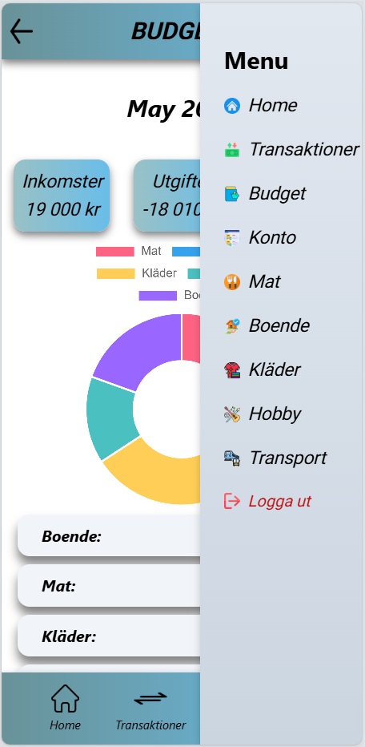

# MoneyApp

MoneyApp is an application designed to help individuals manage their finances. This project uses Angular for the frontend C# for backend with MongoDB.



## Responsive Design

This application is designed to be responsive and can be used on both desktop and mobile devices. The layout and components adjust automatically to provide an optimal user experience on any screen size. However, it is recommended to use this application from a mobile device for the best experience.


# Backend

### Environment Variables
Create a `.env` file in the backend directory and add the following environment variables:
```bash
- MONGODB_CONNECTION_STRING=(replace your MONGODB URL)
- MONGODB_DATABASE_NAME=(replace your MONGODB name)
- JWT_KEY=(replace your JWT_KEY)
- JWT_ISSUER=(replace your JWT_ISSUER)
- JWT_AUDIENCE=(replace your JWT_AUDIENCE)
- SMTP_SERVER=smtp.gmail.com
- SMTP_PORT=587
- SMTP_USERNAME=(replace your gmail)
- SMTP_PASSWORD=(replace your secret password)
```
### Running the Backend

Navigate to the backend directory and run the backend server.

```bash
cd MoneyAppBackend
dotnet run
```

### Endpoints
- Swagger: http://localhost:5234/swagger/index.html (with Swagger)
- Base URL: http://localhost:5234/
#### Auth
- GET api/Auth
- POST api/Auth/login
- POST api/Auth/register

#### Transaction
- GET api/Transaction
- GET api/Transaction/{id}


# Frontend

1. Install the necessary dependencies.
```bash
npm install
```
2. Open your browser and navigate to http://localhost:4200 to see the application.
3. Running the Development Server
```bash
- ng serve
```
4. Page Descriptions
Home: The homepage displays an overview of your financial status.
Transaktioner: Displays transaction history.
Budget: Budget management page.
Konto: Displays account information.


# Docker
### 1.Environment Variables
Create a `.env` file in the backend directory and add the following environment 
variables:
```bash
- MONGODB_CONNECTION_STRING=(replace your MONGODB URL)
- MONGODB_DATABASE_NAME=(replace your MONGODB name)
- JWT_KEY=(replace your JWT_KEY)
- JWT_ISSUER=(replace your JWT_ISSUER)
- JWT_AUDIENCE=(replace your JWT_AUDIENCE)
- SMTP_SERVER=smtp.gmail.com
- SMTP_PORT=587
- SMTP_USERNAME=(replace your gmail)
- SMTP_PASSWORD=(replace your secret password)
```
### 2.Building and Running Docker Containers
docker-compose up --build


# Deployment
- branch: deployment-with-main
Base URL: https://moneyapp2025.netlify.app
### Frontend:
- Netlify
### Backend: 
- Microsoft Azure

```bash
- Username: tester
- Password: password
```